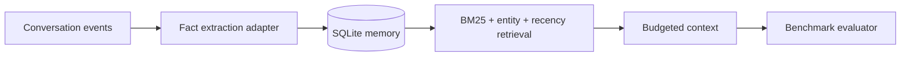

# Agent Memory Bench

[](https://github.com/ZhengjunSun/agent-memory-bench/actions/workflows/ci.yml)

A reproducible benchmark and reference memory layer for stateful agents. It evaluates factual recall, temporal updates, contradiction handling, abstention, token budget, and retrieval latency.



## What this demonstrates

- Append-only memories with explicit supersession instead of destructive overwrite
- Entity, lexical, temporal and recency-aware ranking
- Bounded context construction with token estimates
- Ground-truth benchmark cases for current facts, history and abstention
- Accuracy, MRR, token and latency reporting suitable for CI regression gates
- SQLite persistence and provider-neutral interfaces

## Run

```bash
python -m agent_memory_bench.demo
python -m unittest discover -s tests -v
```

## Verify the claims

- [Memory architecture and benchmark contract](docs/architecture.md)
- [Reproducible scale report](docs/benchmark.md)

```bash
python scripts/benchmark_scale.py --facts 1000 --queries 200
```

All people, organizations and events in the bundled benchmark are fictional.

## Prior art

The design is informed by public concepts from Mem0, Letta, Graphiti, LoCoMo and LongMemEval. The implementation and synthetic benchmark are original.

## License

MIT
