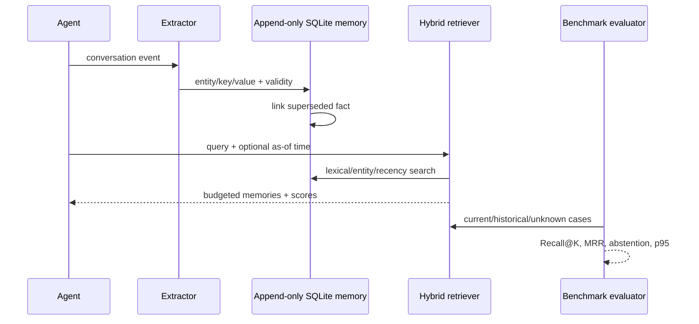

# Memory lifecycle and benchmark contract

## Benchmark rules

- Current and historical facts are scored separately through `as_of` queries.
- Superseded facts remain available for historical questions.
- Unknown questions reward abstention rather than plausible fabrication.
- Retrieval metrics are deterministic; latency is reported independently.
- Synthetic entity names prevent contamination by memorized public facts.

